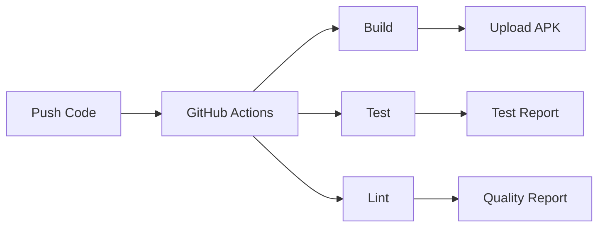

# 🤖 Build Automation Guide

Complete guide to automated building, testing, and deployment for the Android Command Center project.

## 📋 Table of Contents

1. [Automation Overview](#automation-overview)
2. [GitHub Actions Workflows](#github-actions-workflows)
3. [Local Automation Scripts](#local-automation-scripts)
4. [Continuous Integration](#continuous-integration)
5. [Continuous Deployment](#continuous-deployment)
6. [Automated Testing](#automated-testing)
7. [Code Quality Automation](#code-quality-automation)
8. [Release Automation](#release-automation)
9. [Termux Automation](#termux-automation)
10. [Troubleshooting](#troubleshooting)

## 🎯 Automation Overview

This project includes comprehensive automation for:

```
📦 Build Process
├── ✅ Automated compilation
├── ✅ Dependency management
├── ✅ Multi-variant builds
└── ✅ APK/AAB generation

🧪 Testing
├── ✅ Unit tests
├── ✅ Instrumented tests
├── ✅ UI tests
└── ✅ Coverage reports

🔍 Quality Checks
├── ✅ Lint analysis
├── ✅ Code style (Detekt)
├── ✅ Security scanning
└── ✅ Dependency checks

🚀 Deployment
├── ✅ Release builds
├── ✅ APK signing
├── ✅ GitHub releases
└── ✅ Play Store upload (optional)
```

### Benefits of Automation

- ⏱️ **Save Time**: Automatic builds on every commit
- 🐛 **Catch Bugs Early**: Tests run automatically
- 📊 **Quality Assurance**: Continuous code quality checks
- 🔒 **Security**: Automated vulnerability scanning
- 🚀 **Fast Deployment**: One-click releases
- 📱 **Multi-Device Testing**: Test on various Android versions

## 🔄 GitHub Actions Workflows

The project includes 4 main workflows:

### 1. Android CI Build (`.github/workflows/android-build.yml`)

**Triggers**: Push to main/develop, Pull requests

**What it does**:
1. Checks out code
2. Sets up Java 17
3. Caches Gradle dependencies
4. Runs lint checks
5. Runs unit tests
6. Builds debug APK
7. Uploads artifacts

**View in GitHub**: `Actions` → `Android CI Build`

**Manual Trigger**:
```bash
# Via GitHub UI: Actions → Android CI Build → Run workflow
```

### 2. Android Release Build (`.github/workflows/android-release.yml`)

**Triggers**: Git tags (`v*`), Manual

**What it does**:
1. Builds release APK
2. Builds release AAB
3. Signs builds (if secrets configured)
4. Creates GitHub release
5. Uploads release artifacts

**Create Release**:
```bash
# Tag a release
git tag -a v1.0.0 -m "Release version 1.0.0"
git push origin v1.0.0

# GitHub Actions automatically creates release
```

### 3. Automated Testing (`.github/workflows/automated-testing.yml`)

**Triggers**: Push, Pull requests, Daily schedule

**What it does**:
1. Runs unit tests
2. Runs instrumented tests on emulator
3. Tests on multiple Android versions (31, 33, 34)
4. Runs UI tests
5. Captures screenshots
6. Generates test reports

**View Test Results**: `Actions` → `Automated Testing` → Check run

### 4. Code Quality Analysis (`.github/workflows/code-quality.yml`)

**Triggers**: Push, Pull requests

**What it does**:
1. Runs Android Lint
2. Runs Detekt (Kotlin linter)
3. Checks dependency vulnerabilities
4. Runs security scans
5. Annotates code with issues

**View Quality Reports**: `Actions` → `Code Quality Analysis`

## 🛠️ Local Automation Scripts

### Build Script

Create `scripts/build.sh`:

```bash
#!/bin/bash

echo "🏗️  Starting automated build..."

# Colors for output
GREEN='\033[0;32m'
RED='\033[0;31m'
NC='\033[0m' # No Color

# Function to print success
success() {
    echo -e "${GREEN}✅ $1${NC}"
}

# Function to print error
error() {
    echo -e "${RED}❌ $1${NC}"
    exit 1
}

# Clean build
echo "🧹 Cleaning..."
./gradlew clean || error "Clean failed"
success "Clean completed"

# Run lint
echo "🔍 Running lint..."
./gradlew lintDebug || error "Lint failed"
success "Lint passed"

# Run tests
echo "🧪 Running tests..."
./gradlew test || error "Tests failed"
success "Tests passed"

# Build APK
echo "📦 Building APK..."
./gradlew assembleDebug || error "Build failed"
success "Build completed"

echo ""
echo "🎉 Build completed successfully!"
echo "APK location: app/build/outputs/apk/debug/app-debug.apk"
```

Make executable:
```bash
chmod +x scripts/build.sh
./scripts/build.sh
```

### Test Script

Create `scripts/test.sh`:

```bash
#!/bin/bash

echo "🧪 Starting automated testing..."

GREEN='\033[0;32m'
RED='\033[0;31m'
YELLOW='\033[1;33m'
NC='\033[0m'

success() { echo -e "${GREEN}✅ $1${NC}"; }
error() { echo -e "${RED}❌ $1${NC}"; }
warning() { echo -e "${YELLOW}⚠️  $1${NC}"; }

# Unit tests
echo "Running unit tests..."
./gradlew testDebugUnitTest
if [ $? -eq 0 ]; then
    success "Unit tests passed"
else
    error "Unit tests failed"
    exit 1
fi

# Check for connected device
adb devices | grep -q "device$"
if [ $? -eq 0 ]; then
    echo "📱 Device detected, running instrumented tests..."
    ./gradlew connectedDebugAndroidTest
    if [ $? -eq 0 ]; then
        success "Instrumented tests passed"
    else
        warning "Instrumented tests failed"
    fi
else
    warning "No device connected, skipping instrumented tests"
fi

# Generate coverage report
echo "📊 Generating coverage report..."
./gradlew jacocoTestReport

success "Testing completed!"
echo "Test reports: app/build/reports/tests/"
echo "Coverage reports: app/build/reports/jacoco/"
```

### Release Script

Create `scripts/release.sh`:

```bash
#!/bin/bash

# Automated release script
echo "🚀 Automated Release Process"

# Check if version provided
if [ -z "$1" ]; then
    echo "Usage: ./scripts/release.sh <version>"
    echo "Example: ./scripts/release.sh 1.0.0"
    exit 1
fi

VERSION=$1
TAG="v$VERSION"

echo "Creating release version: $VERSION"

# Update version in build.gradle.kts
echo "📝 Updating version..."
# This is a simplified example - adjust for your needs
sed -i "s/versionName = \".*\"/versionName = \"$VERSION\"/" app/build.gradle.kts

# Run tests
echo "🧪 Running tests..."
./scripts/test.sh || exit 1

# Build release
echo "📦 Building release..."
./gradlew assembleRelease bundleRelease || exit 1

# Commit version change
echo "💾 Committing version change..."
git add app/build.gradle.kts
git commit -m "Bump version to $VERSION"

# Create tag
echo "🏷️  Creating tag..."
git tag -a "$TAG" -m "Release version $VERSION"

# Push
echo "⬆️  Pushing to GitHub..."
git push origin main
git push origin "$TAG"

echo "✅ Release $VERSION created successfully!"
echo "GitHub Actions will automatically create the release."
```

### Quick Commands Script

Create `scripts/quick.sh`:

```bash
#!/bin/bash

# Quick commands for common tasks

case "$1" in
    build)
        echo "🏗️  Quick build..."
        ./gradlew assembleDebug
        ;;
    test)
        echo "🧪 Quick test..."
        ./gradlew testDebugUnitTest
        ;;
    install)
        echo "📱 Installing on device..."
        ./gradlew installDebug
        ;;
    clean)
        echo "🧹 Cleaning..."
        ./gradlew clean
        ;;
    lint)
        echo "🔍 Running lint..."
        ./gradlew lintDebug
        ;;
    run)
        echo "🚀 Building and installing..."
        ./gradlew assembleDebug installDebug
        adb shell am start -n com.androidcommandcenter/.MainActivity
        ;;
    logs)
        echo "📋 Showing logs..."
        adb logcat -c
        adb logcat | grep "com.androidcommandcenter"
        ;;
    *)
        echo "Usage: ./scripts/quick.sh [command]"
        echo ""
        echo "Commands:"
        echo "  build    - Build debug APK"
        echo "  test     - Run unit tests"
        echo "  install  - Install on device"
        echo "  clean    - Clean build"
        echo "  lint     - Run lint checks"
        echo "  run      - Build, install, and launch"
        echo "  logs     - Show app logs"
        exit 1
        ;;
esac
```

Usage:
```bash
chmod +x scripts/quick.sh
./scripts/quick.sh build
./scripts/quick.sh test
./scripts/quick.sh run
```

## 🔄 Continuous Integration

### Setup CI

1. **Enable GitHub Actions** (automatically enabled for new repos)

2. **Add Status Badge** to README.md:
```markdown

```

3. **Configure Branch Protection**:
   - Go to: Settings → Branches → Add rule
   - Branch name: `main`
   - ✅ Require status checks to pass
   - ✅ Require branches to be up to date
   - Select: `build`, `test`, `code-quality`

### CI Workflow



### Viewing CI Results

1. Go to GitHub repository
2. Click **Actions** tab
3. Select workflow run
4. View job details
5. Download artifacts

### CI Best Practices

- ✅ Run tests on every commit
- ✅ Fast feedback (< 10 minutes)
- ✅ Cache dependencies
- ✅ Parallel job execution
- ✅ Clear failure messages
- ✅ Automated notifications

## 🚀 Continuous Deployment

### Setup CD for Releases

1. **Create Keystore** for signing:
```bash
keytool -genkey -v -keystore release.keystore \
  -alias lindyandroid -keyalg RSA -keysize 2048 -validity 10000
```

2. **Encode Keystore** to Base64:
```bash
base64 -i release.keystore -o keystore.txt
# Copy contents of keystore.txt
```

3. **Add GitHub Secrets**:
   - Go to: Settings → Secrets → Actions
   - Add secrets:
     - `KEYSTORE_BASE64`: Base64 encoded keystore
     - `SIGNING_KEY_ALIAS`: Key alias
     - `SIGNING_KEY_PASSWORD`: Key password
     - `SIGNING_STORE_PASSWORD`: Keystore password

4. **Create Release**:
```bash
git tag -a v1.0.0 -m "Release 1.0.0"
git push origin v1.0.0
```

GitHub Actions will automatically:
- Build release APK and AAB
- Sign the builds
- Create GitHub release
- Upload artifacts

### CD Workflow

```
Tag Created → Build Release → Sign → Upload → Create Release
```

### Automated Play Store Upload (Optional)

Add to `.github/workflows/android-release.yml`:

```yaml
- name: Upload to Play Store
  uses: r0adkll/upload-google-play@v1
  with:
    serviceAccountJsonPlainText: ${{ secrets.SERVICE_ACCOUNT_JSON }}
    packageName: com.androidcommandcenter
    releaseFiles: app/build/outputs/bundle/release/app-release.aab
    track: internal
    status: completed
```

Setup:
1. Create Google Play service account
2. Download JSON key
3. Add as GitHub secret: `SERVICE_ACCOUNT_JSON`

## 🧪 Automated Testing

### Test Configuration

Add to `app/build.gradle.kts`:

```kotlin
android {
    // Enable test options
    testOptions {
        unitTests {
            isIncludeAndroidResources = true
            isReturnDefaultValues = true
        }
        
        animationsDisabled = true
    }
}

dependencies {
    // Testing dependencies
    testImplementation("junit:junit:4.13.2")
    testImplementation("org.mockito:mockito-core:5.7.0")
    testImplementation("org.robolectric:robolectric:4.11.1")
    
    androidTestImplementation("androidx.test.ext:junit:1.2.1")
    androidTestImplementation("androidx.test.espresso:espresso-core:3.6.1")
    androidTestImplementation("androidx.test:runner:1.6.1")
    androidTestImplementation("androidx.test:rules:1.6.1")
}
```

### Test Coverage

Add to `app/build.gradle.kts`:

```kotlin
plugins {
    id("jacoco")
}

jacoco {
    toolVersion = "0.8.11"
}

tasks.register<JacocoReport>("jacocoTestReport") {
    dependsOn("testDebugUnitTest")
    
    reports {
        xml.required.set(true)
        html.required.set(true)
    }
    
    sourceDirectories.setFrom(files("src/main/java"))
    classDirectories.setFrom(files("$buildDir/intermediates/classes/debug"))
    executionData.setFrom(files("$buildDir/jacoco/testDebugUnitTest.exec"))
}
```

Run with:
```bash
./gradlew testDebugUnitTest jacocoTestReport
```

### Test Reports

View reports:
- **Unit Tests**: `app/build/reports/tests/testDebugUnitTest/index.html`
- **Coverage**: `app/build/reports/jacoco/jacocoTestReport/html/index.html`
- **Lint**: `app/build/reports/lint-results-debug.html`

## 🔍 Code Quality Automation

### Detekt Configuration

Create `detekt.yml`:

```yaml
build:
  maxIssues: 10
  
complexity:
  LongMethod:
    threshold: 60
  LongParameterList:
    functionThreshold: 6
    
style:
  MaxLineLength:
    maxLineLength: 120
  
naming:
  FunctionNaming:
    functionPattern: '[a-z][a-zA-Z0-9]*'
```

Add to `app/build.gradle.kts`:

```kotlin
plugins {
    id("io.gitlab.arturbosch.detekt") version "1.23.4"
}

detekt {
    config.setFrom(files("$rootDir/detekt.yml"))
    buildUponDefaultConfig = true
}

dependencies {
    detektPlugins("io.gitlab.arturbosch.detekt:detekt-formatting:1.23.4")
}
```

Run:
```bash
./gradlew detekt
```

### Lint Configuration

Create `lint.xml`:

```xml
<?xml version="1.0" encoding="UTF-8"?>
<lint>
    <issue id="IconMissingDensityFolder" severity="ignore" />
    <issue id="ObsoleteLayoutParam" severity="warning" />
    <issue id="UnusedResources" severity="warning" />
    <issue id="HardcodedText" severity="error" />
</lint>
```

Add to `app/build.gradle.kts`:

```kotlin
android {
    lint {
        lintConfig = file("$rootDir/lint.xml")
        abortOnError = false
        checkReleaseBuilds = true
        htmlReport = true
        xmlReport = true
    }
}
```

## 📱 Termux Automation

### Automated Git Sync

Create `~/.shortcuts/sync-lindy.sh`:

```bash
#!/data/data/com.termux/files/usr/bin/bash

cd ~/storage/shared/AndroidCommandCenter

# Pull latest changes
echo "📥 Pulling latest changes..."
git pull origin main

# Check for local changes
if [[ -n $(git status -s) ]]; then
    echo "📝 Local changes detected"
    
    # Add all changes
    git add .
    
    # Commit with timestamp
    git commit -m "Auto sync $(date +%Y-%m-%d\ %H:%M)"
    
    # Push to GitHub
    echo "📤 Pushing changes..."
    git push origin main
    
    # Notify
    termux-notification \
        -t "Git Sync Complete" \
        -c "LindyAndroid synced to GitHub"
else
    echo "✅ Already up to date"
    termux-notification \
        -t "Git Sync" \
        -c "Already up to date"
fi
```

Make executable:
```bash
chmod +x ~/.shortcuts/sync-lindy.sh
```

Add to home screen via Termux:Widget!

### Automated Build Notifications

Create `~/.shortcuts/check-build.sh`:

```bash
#!/data/data/com.termux/files/usr/bin/bash

# Check latest GitHub Actions run
REPO="Markus911111/AndroidCommandCenter"
API_URL="https://api.github.com/repos/$REPO/actions/runs?per_page=1"

# Fetch latest run
RESPONSE=$(curl -s "$API_URL")

# Parse status
STATUS=$(echo "$RESPONSE" | grep -o '"status":"[^"]*"' | head -1 | cut -d'"' -f4)
CONCLUSION=$(echo "$RESPONSE" | grep -o '"conclusion":"[^"]*"' | head -1 | cut -d'"' -f4)

if [ "$STATUS" == "completed" ]; then
    if [ "$CONCLUSION" == "success" ]; then
        termux-notification \
            -t "✅ Build Successful" \
            -c "Latest build passed all checks"
        termux-tts-speak "Build successful"
    else
        termux-notification \
            -t "❌ Build Failed" \
            -c "Latest build failed"
        termux-tts-speak "Build failed"
    fi
else
    termux-notification \
        -t "⏳ Build in Progress" \
        -c "Build status: $STATUS"
fi
```

### Cron Jobs in Termux

Setup automated tasks:

```bash
# Install cronie
pkg install cronie

# Edit crontab
crontab -e

# Add jobs:
# Sync every 2 hours
0 */2 * * * ~/. shortcuts/sync-lindy.sh

# Check build daily at 9 AM
0 9 * * * ~/.shortcuts/check-build.sh

# Save and exit
```

Start cron:
```bash
crond
```

## 🐛 Troubleshooting

### Build Fails in CI

**Issue**: "Task failed with an exception"

**Solutions**:
```bash
# Check Gradle version compatibility
./gradlew --version

# Update Gradle wrapper
./gradlew wrapper --gradle-version=8.9

# Clear cache
./gradlew clean --no-daemon
```

### Tests Timeout

**Issue**: Tests exceed time limit

**Solution** - Add to `app/build.gradle.kts`:
```kotlin
android {
    testOptions {
        unitTests {
            all {
                it.testLogging {
                    events("passed", "skipped", "failed")
                }
                it.timeout.set(Duration.ofMinutes(10))
            }
        }
    }
}
```

### Signing Fails

**Issue**: "Key was created with errors"

**Solutions**:
1. Verify secrets in GitHub
2. Check keystore encoding:
```bash
base64 -d keystore.txt > test.keystore
keytool -list -keystore test.keystore
```

### Out of Memory

**Issue**: "OutOfMemoryError: Java heap space"

**Solution** - Add to `gradle.properties`:
```properties
org.gradle.jvmargs=-Xmx4096m -XX:MaxMetaspaceSize=512m
```

## 📊 Monitoring Automation

### GitHub Actions Dashboard

View all workflows:
1. Go to repository
2. Click **Actions**
3. See all workflow runs
4. Filter by status/branch

### Status Badges

Add to README.md:

```markdown


```

### Email Notifications

Enable in GitHub:
- Settings → Notifications
- ✅ GitHub Actions
- ✅ Send notifications for failed workflows

## 🎯 Best Practices

### CI/CD Best Practices

- ✅ **Fast Feedback**: Keep builds under 10 minutes
- ✅ **Fail Fast**: Run quick tests first
- ✅ **Cache Dependencies**: Speed up builds
- ✅ **Parallel Jobs**: Run tests simultaneously
- ✅ **Clear Logs**: Descriptive step names
- ✅ **Security**: Use secrets for sensitive data
- ✅ **Versioning**: Semantic versioning for releases

### Testing Best Practices

- ✅ **Write Tests First**: TDD approach
- ✅ **Test Coverage**: Aim for 80%+
- ✅ **Fast Tests**: Unit tests < 1 second
- ✅ **Isolated Tests**: No dependencies between tests
- ✅ **Mock External Dependencies**: Don't hit real APIs
- ✅ **Test Edge Cases**: Not just happy path

### Automation Tips

- 💡 Start small, automate incrementally
- 💡 Monitor workflow execution times
- 💡 Review and optimize regularly
- 💡 Document custom workflows
- 💡 Use workflow templates for consistency
- 💡 Keep secrets secure

## 🎓 Learning Resources

- [GitHub Actions Docs](https://docs.github.com/en/actions)
- [Gradle Build Tool](https://docs.gradle.org/)
- [Android Testing](https://developer.android.com/training/testing)
- [CI/CD Best Practices](https://www.atlassian.com/continuous-delivery/principles/continuous-integration-vs-delivery-vs-deployment)

## ✅ Automation Checklist

- [ ] GitHub Actions workflows configured
- [ ] Secrets added for signing
- [ ] Local build scripts created
- [ ] Tests running automatically
- [ ] Code quality checks enabled
- [ ] Release process automated
- [ ] Notifications configured
- [ ] Documentation updated
- [ ] Team trained on workflows

---

**Navigation**:  
← [09-REPOSITORY-ECOSYSTEM.md](09-REPOSITORY-ECOSYSTEM.md) | [INDEX.md](INDEX.md) | [Back to README](../README.md) →
